# Stackarr

Stackarr is a collection containers to provide basically everything you need from the *arr stack!
It is easily scalable, as it is as easy as just adding the services to the docker compose file and redeploying it.

## Overview

Stackarr has the following services by default in it:
- [Flaresolverr](https://github.com/FlareSolverr/FlareSolverr)
- [Prowlarr](https://prowlarr.com/)
- [Sonarr](https://sonarr.tv/)
- [Radarr](https://radarr.video/)
- [Jellyfin](https://jellyfin.org/)
- [Seerr](https://docs.seerr.dev/)
- [Deluge](https://deluge-torrent.org/)

If you want, you can add or remove the services as you wish.
For example you can add [Lidarr](https://lidarr.audio/), you can also change Deluge for [qbittorrent](https://www.qbittorrent.org/) or [Transmission](https://transmissionbt.com/).

For more you can check out this curated list of *arr for more options: https://github.com/Ravencentric/awesome-arr

## Folder structures

The folder structure is very easy to manage:

```
stackarr
├── config
│   ├── prowlarr
│   ├── sonarr
│   ├── radarr
│   ├── jellyfin
│   ├── seerr
│   └── deluge
├── media
│   ├── TV Series
│   ├── Anime
│   └── Movies
└── downloads
```

It is recommended to replace all the dynamic folders with an absolute path.
You can simply open the docker compose file with any text editor find and replace all the `./` characters.

## Trouble shooting

Make sure that all the folders are owned by you (and not by `root`) on the server.
Else containers like Jellyfin or Seerr won't be able to write the folders.

## Guide for Stackarr

### Summary

This is a guide on how to use the services for Stackarr.
Flaresolverr isn't configured as it doesn't really need configuration.

- [Deluge](#deluge)
- [Sonarr](#sonarr)
- [Radarr](#radarr)
- [Prowlarr](#prowlarr)
- [Jellyfin](#jellyfin)
- [Seerr](#seerr)
- [Cleanuparr](#cleanuparr)

---

### Deluge

**[`^        back to summary        ^`](#summary)**

Deluge is a lightweight BitTorrent client. The main tool for which you will use to download stuff from the internet.

You can access Deluge by browsing to http://your.server.ip:8112 on your browser.
You will be prompted for a password, like below:

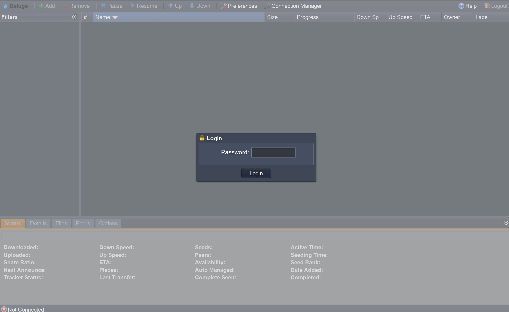

NOTE: The WebUI won't be of the same color on first login, as this the `access` theme.

The default password of the docker container is `deluge`.
Afterwards, you will be prompted to change the password, make sure it is a secure one.
You can always change password inside by going into `preferences` (on the top bar) -> `interface` tab -> WebUI Password.

Here you can also change the theme of the WebUI if you don't want light mode.

You will also need to enable the `label` plugin for Cleanuparr later, you can do so by going into the `plugin` tab (under `preferences`), and enabling the `label` plugin.

If you don't see the label plugin, or any plugins, then it is recommended to rollback the version of deluge.
You can do so by modifying the docker compose and instead of using `deluge:latest`, you can use `deluge:2.2.0-r1-ls364` (`deluge:arm64v8-2.2.0-r1-ls364` for ARM cpus).

Once you rebuild the container you should see the plugins available, simply check the `Label` plugin like below:

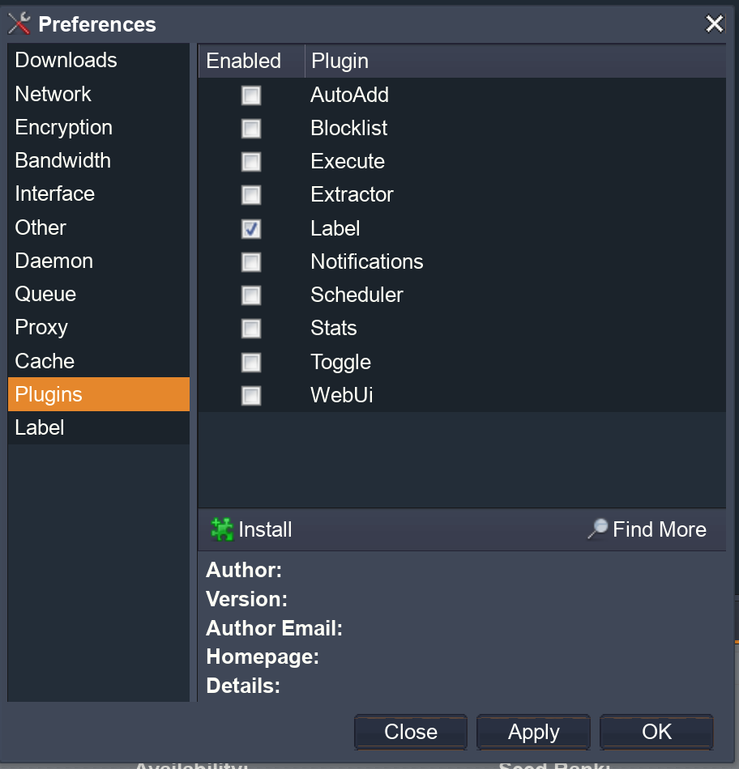

---

### Sonarr

**[`^        back to summary        ^`](#summary)**

Sonarr is an automated media manager, it can automatically connect to your download client (Deluge in this case), and manage all your downloaded files.
It can automatically move / copy downloaded content to other folders.

We will be using Sonarr to manage the TV series that we download with Deluge, and moving it into a folder that Jellyfin can see and stream from.
You can also use the download folder directly for Jellyfin, but then it won't be organised into subfolder structures.

On the first login into Sonarr (at http://your.server.ip:8989), you will meet an Authentication Required prompt like below:

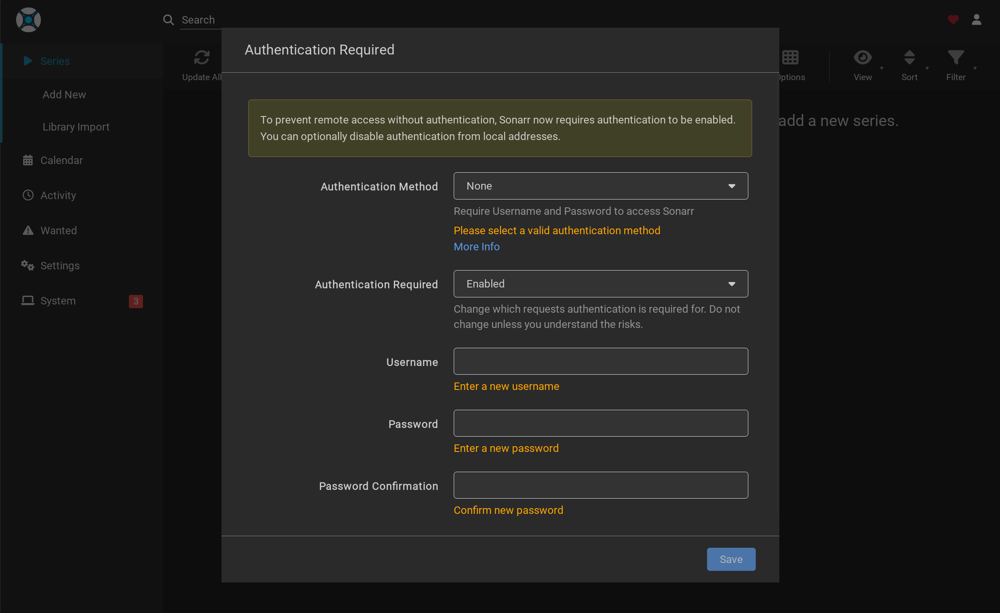

Enable the authentication method to `Forms (Login Page)`, and add a username and password (you can change this in Settings > General > Security).
Next, you will need to add the other services.

First of all, for the folder management, go to Settings > Media Management.
You will have to add the root folders (the folders where Sonarr will place all the downloaded media).
In the docker compose we mounted the TV series under `/tv` and Animes under `/anime`, so we can add those two to the root folders.

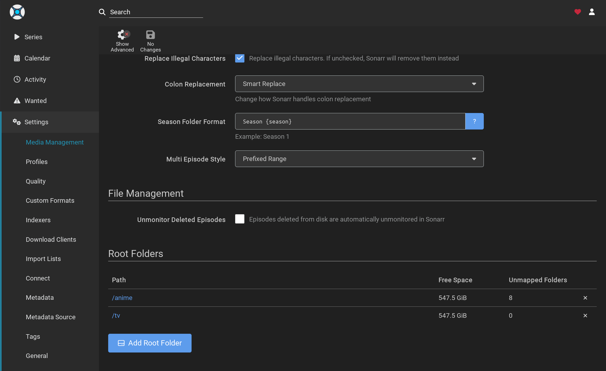

The next part is adding our download client, which is Deluge in this case.
Go to Settings > Download Clients and click the `+` symbol, you will be prompted to choose a download client.

Choose the Deluge option under Torrents.
You will be prompted to enter the details for the details to connect to deluge

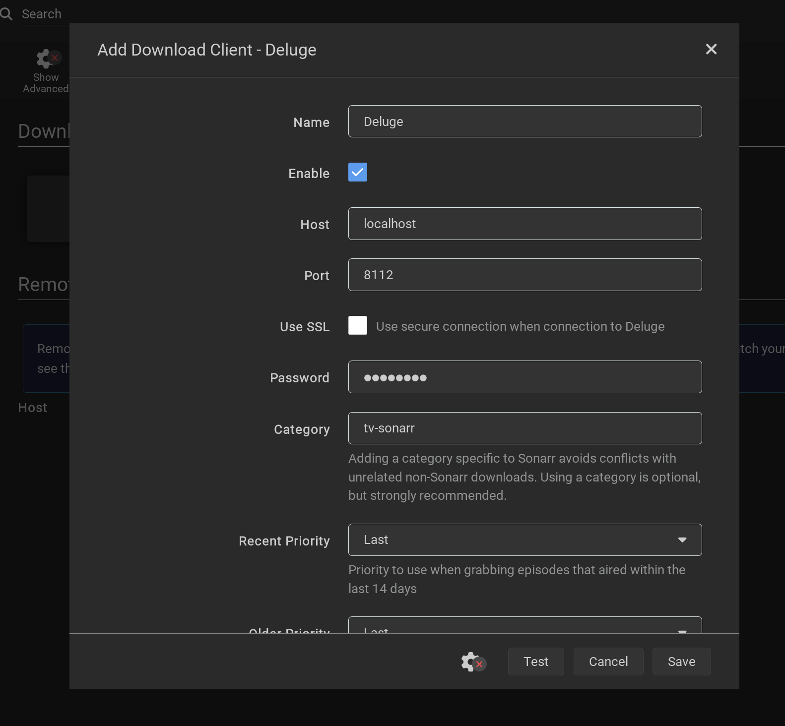

You can leave most of it as it is, except for the `host` section, you need to change that to `deluge`, as that is the hostname we choosed for in the docker compose (also make sure that sonarr and deluge are in the same network).

With that Sonarr is configured, for the indexers they will automatically be added by prowlarr.

NOTE: for convenience go to Settings > General > Security and copy the API Key, keep it somewhere safe. We will need it later on when we setup prowlarr and cleanuparr. 

---

### Radarr

**[`^        back to summary        ^`](#summary)**

Radarr's configuration will work the exact same as [Sonarr's](#sonarr), except that you can access Radarr's webui through http://your.server.ip:7878 instead of port 8989.

You will also need to add the `/movies` folder instead of `/tv` and `/anime` in the root folder.

Same note as Sonarr, please copy the API Key and keep it somewhere safe.

---

### Prowlarr

**[`^        back to summary        ^`](#summary)**

Prowlarr is your torrent indexer tracker. It automatically adds the indexers to Radarr and Sonarr when you add it on Prowlarr.

When you first log into Prowlarr from http://your.server.ip:9696, you will be greeted with an Authentication Required prompt like below:

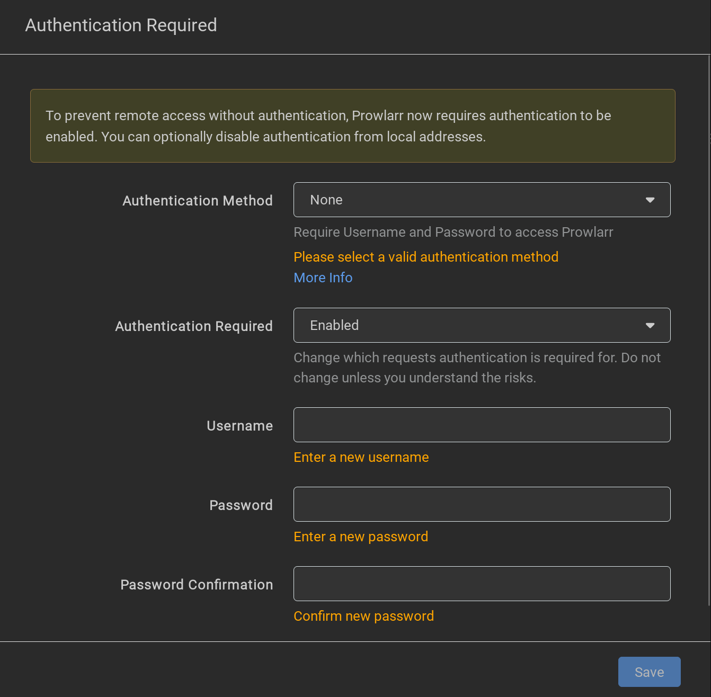

Enable the authentication method to `Forms (Login Page)`, and add a username and password.
Next, you will need to add your apps.
Go under Settings > Apps and add Sonarr and Radarr.

You will be shown a prompt like this:

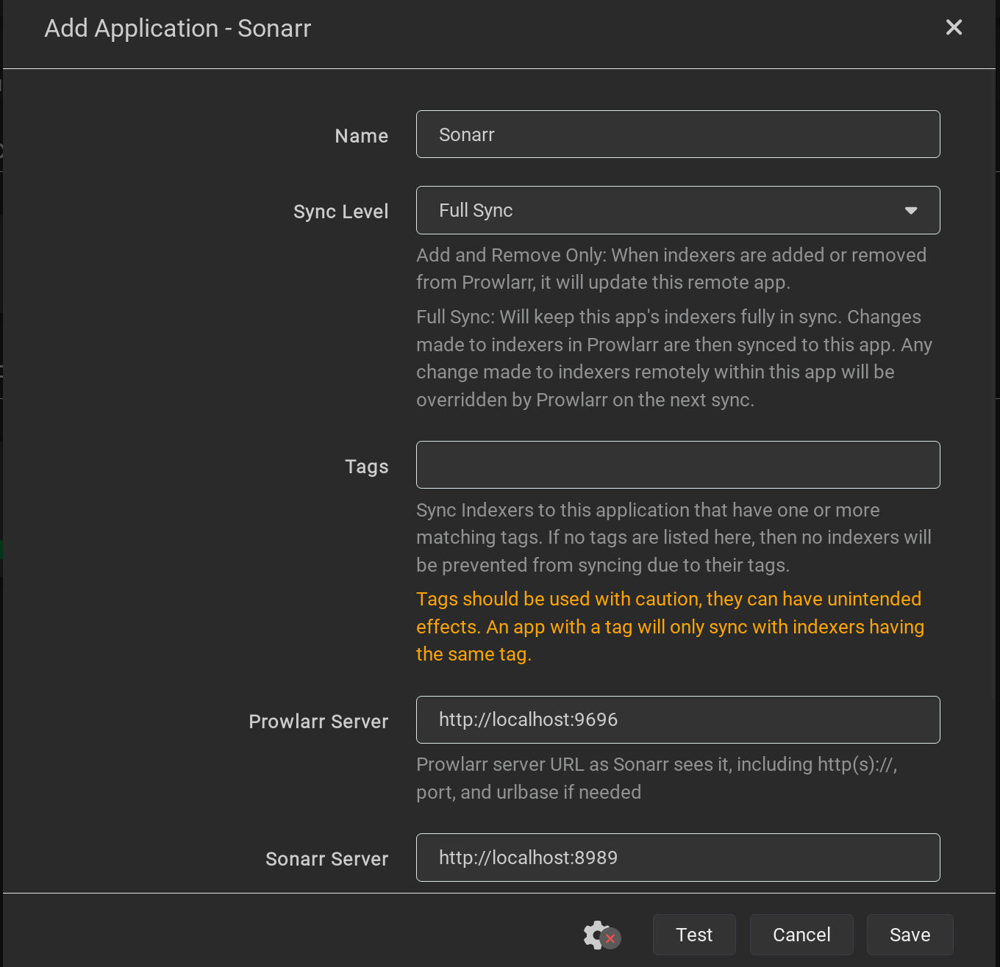

You can leave the first 3 fields (Name, Sync Level and Tags) as they are, while you will need to change the next 3 fields (Prowlarr's server, Sonarr's server and API Key).

Instead of `localhost`, use `prowlarr` for the Prowlarr Server field, and `sonarr` for the Sonarr Server field (do not change the port number).

And subsequently add the API Key for the service.
You will have to repeat the same procedure for each services you want to add (only Sonarr and Radarr in this case).

Since we will be doing the requests in Seerr, Sonarr and Radarr, we won't need to add a download client.
But instead we will need to add an Indexer so that we can use a proxy to bypass the some limitations.

Under Settings > Indexers, add FlareSolverr, and instead of `localhost` use `flaresolverr`.
You can add any tag that you like for it, but `flaresolverr` is my go to:

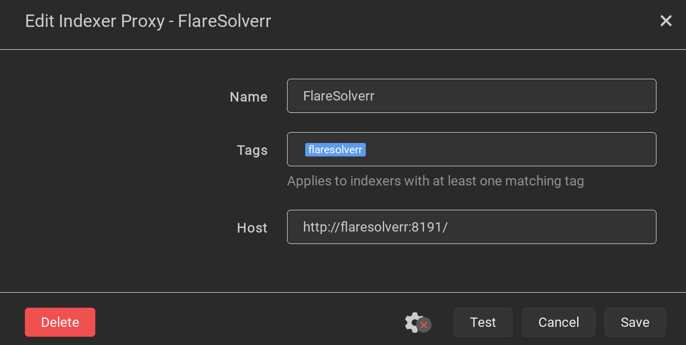

Now you can go under Indexers and add any indexer you want, it will automatically be added to Sonarr and Radarr.
If you can't add an indexer try to add the FlareSolverr tag to the indexer so that it passes by FlareSolver to bypass Cloudflare's protection.

---

### Jellyfin

**[`^        back to summary        ^`](#summary)**

For Jellyfin's configuration (you can access the setup wizard at http://your.server.ip:8096) you can follow the official guide:

https://jellyfin.org/docs/general/post-install/setup-wizard/

Just add the `/media/TV Series`, `/media/Anime`, `/media/Movies` folders for the media library, with the appropriate content types of course (Shows for TV Series and Anime, Movie for Movies)

---

### Seerr

**[`^        back to summary        ^`](#summary)**

Seerr will be the main site where you choose the movie you want to download and add to your Jellyfin server.
You can access your Seerr instance at http://your.server.ip:5055 and you will be greeted with the first login screen.

Choose Jellyfin as your server, add your jellyfin server URL (http://jellyfin:8096) along with the credentials you gave to Jellyfin, this will enable you to access Seerr with your Jellyfin credentials.

For the next few sections you can follow the official guide for Seerr: https://docs.seerr.dev/category/settings

For the media library, let Seerr scan the library accordingly so that it can automatically know if a certain media is added or not.

Just use `sonarr` and `radarr` for when you need to add your Sonarr and Radarr instance (in hostname / IP address) so that it is routed through the Docker network's internal DNS instead of the server's IP address:

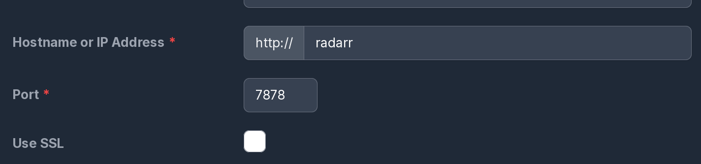

Once you have finished the setup, you will be able to use Seerr to request any movie or anime or tv serie you can find on there and send it to Sonarr or Radarr for request.

---

### Cleanuparr

**[`^        back to summary        ^`](#summary)**

Cleanuparr is optional, but an important set for my *arr stack, as it automatically cleans off the download folder and doesn't let it bloat with all the copied files from Sonarr and Radarr.

For example you can setup a few rules so that it removes downloads that are stalled or slow from Deluge, you can also give it a rule so it seeds the downloads for only a set number of time and then remove the downloaded file from the download folder.

When you first log into Cleanuparr (at http://your.server.ip:11011) you will be greeted with an initial setup request,
Enter your credentials as you wish.

We don't have a plex account since we are using Jellyfin, so we can skip the Plex setup.
Next you can sign into the instance with the credentials you gave earlier.

You will see a dashboard as follow:

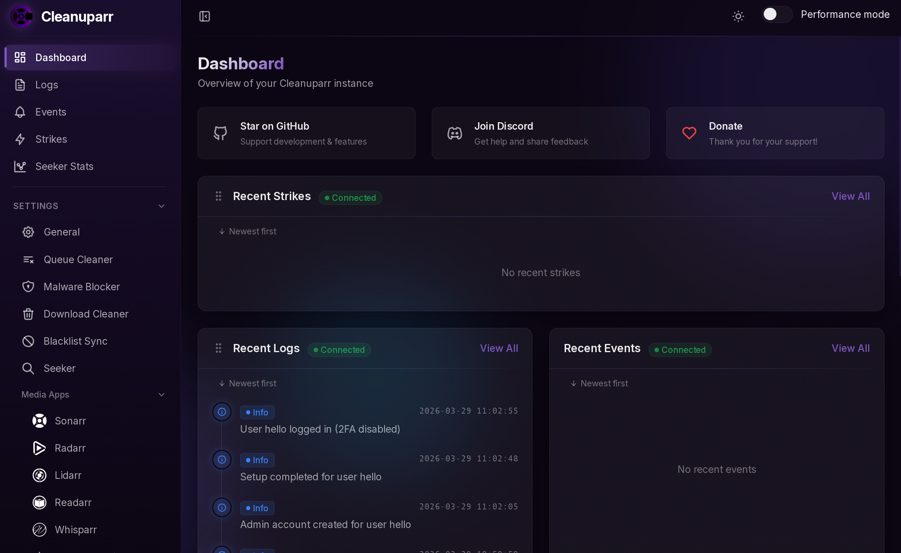

The first few things to do is to setup the media apps.
Add an instance to Sonarr and Radarr with `sonarr` and `radarr` as URL's hostname instead of `localhost` (you can leave the external URL empty if you like) along with their respective API Keys.

This will connect Cleanuparr to Sonarr and Radarr.
Next you need to add the download client, use Deluge as client type and use `http://deluge:8112` as the URL for this setup (instead of `localhost`).

This will connect Cleanuparr to the download client so that it can remove torrents that aren't needed.
Next you can add the rules as you wish.
Personally i use the Queue Cleaner with a stalled rule along with a slow download rule:

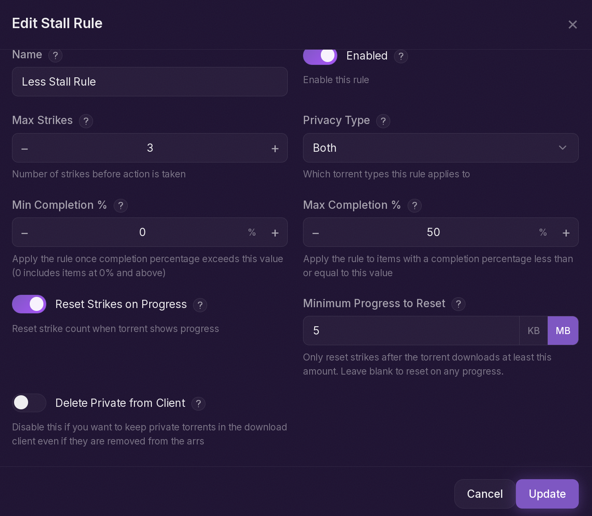

For the Download Cleaner, we enabled the `Label` plugin for Deluge in order to use this specifically.
You can set a two different rules for the `tv-sonarr` category and `radarr` category and give them each a seed time as you wish, so that after a certain amount of time Cleanuparr will remove the torrent automatically.